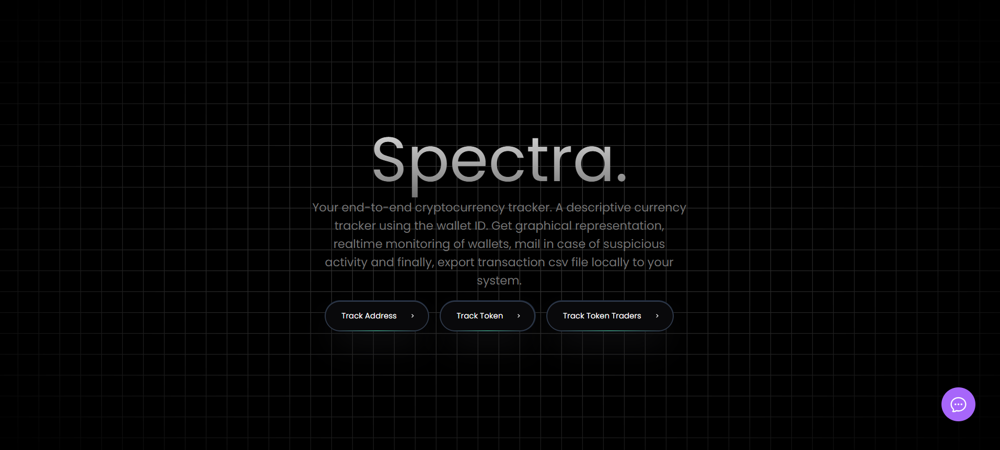
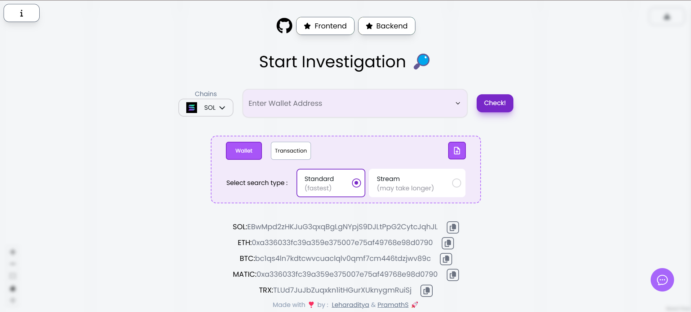
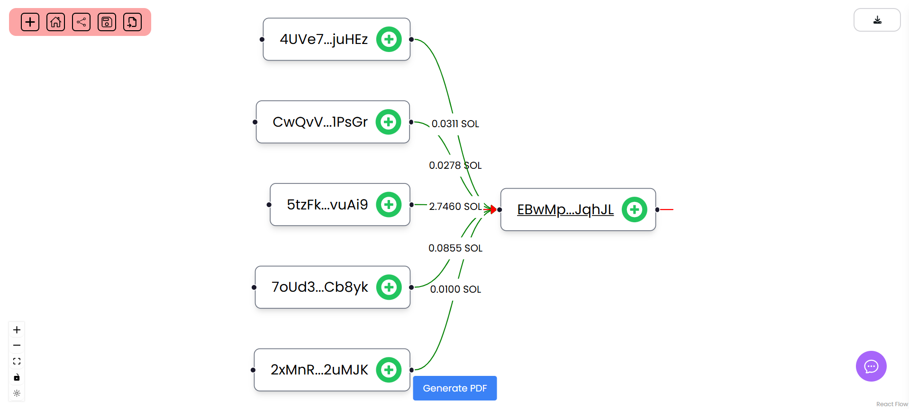
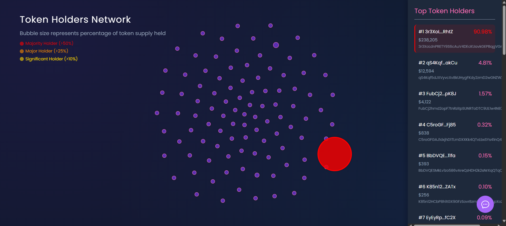
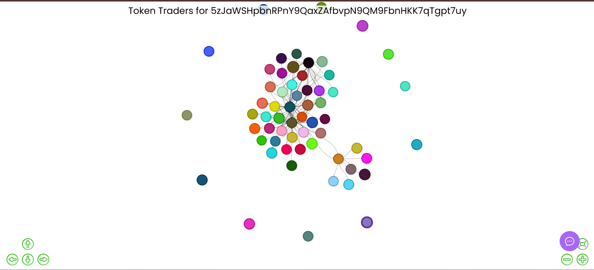
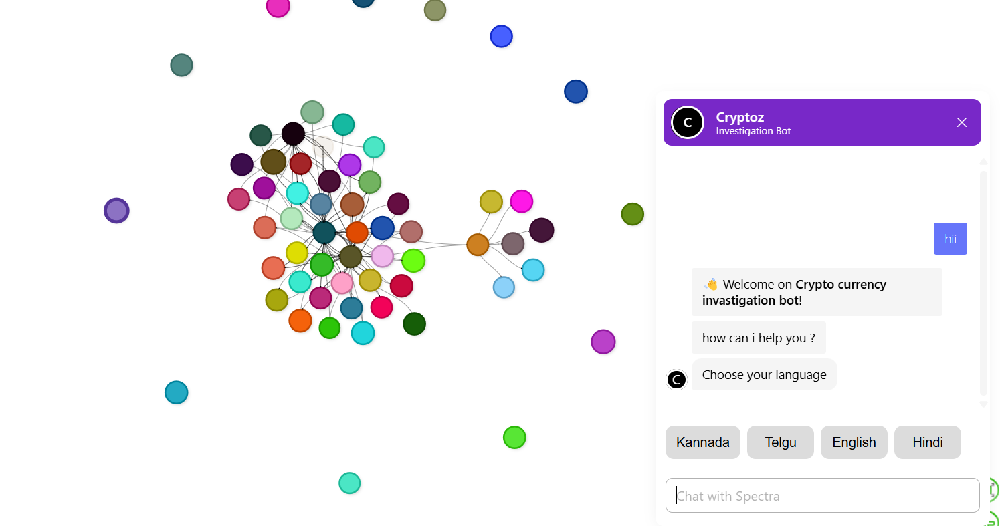

# Solana On-Chain Analysis

A comprehensive tool for analyzing Solana blockchain data with real-time streaming capabilities.

## Prerequisites

This project needs the following requirements:

- [Node.js](https://nodejs.org/) (version 14 or higher)
- [npm](https://www.npmjs.com/) 

## Cloning the Repository

1. Open terminal & navigate to the directory where you want to clone the repository.
2. Run the following command to clone the repository:

```bash
git clone https://github.com/pramaths/solana-onchainanalysis.git
```
3. Navigate into the cloned directory:
```bash
cd onchainanalysis/
```

## Installing Dependencies
> ⚠️ Skip if using Docker 

Once you have cloned the repository, you need to install the required dependencies. Run the following command:
```bash
npm install
```

## Running the Server
> ⚠️ Skip if using Docker 

After the dependencies are installed, you can start the server with the following command (it will be at `localhost:8000` by default):
```bash
node .\index.js
```

## Using Docker
Make sure you have `.env` in the root folder & docker daemon is running 
```bash
docker-compose up --build
```
If all the tests work properly, server will be running on `localhost:8000` (by default)

## Large Media Files
This project uses Git LFS (Large File Storage) for managing media files. To work with these files:

1. Install Git LFS on your system: https://git-lfs.github.com/
2. Set up Git LFS in your local repository:
   ```bash
   git lfs install
   ```
3. The repository is already configured to track MP4 files with Git LFS.

For the main demonstration video:
- Download from: [https://drive.google.com/file/d/1uldH9ug0lGjoH2rPJAzrv87ez-Fv7oIG/view?usp=sharing](https://drive.google.com/file/d/1uldH9ug0lGjoH2rPJAzrv87ez-Fv7oIG/view?usp=sharing)
- Place it in the `public/` directory as `Spectra.mp4`

## Advanced Investigation Capabilities

This platform provides powerful blockchain investigation tools that enable:

- **Deep Transaction Tracing**: Follow transaction paths up to 4 levels deep to uncover complex financial relationships and patterns
- **Entity Clustering**: Automatically identify related addresses and cluster them based on transaction behaviors
- **Anomaly Detection**: Highlight unusual transaction patterns or suspicious activities in real-time
- **Cross-Chain Analysis**: Track assets as they move between Solana and other blockchains through bridges
- **Wallet Profiling**: Generate comprehensive profiles of wallet activities, token holdings, and interaction patterns

## Real-Time Streaming Architecture

The system implements a sophisticated Server-Sent Events (SSE) streaming architecture that provides:

- **Multi-Level Depth Streaming**: Monitor transaction flows in real-time up to 4 levels deep from a target address
- **Filtered Event Streams**: Configure custom filters to receive only relevant blockchain events
- **Low-Latency Updates**: Receive blockchain data with minimal delay (<500ms from block confirmation)
- **Persistent Connections**: Maintain reliable streaming connections with automatic reconnection handling
- **Scalable Implementation**: The streaming architecture can handle thousands of concurrent connections
- **Custom Event Triggers**: Set up alerts and notifications based on specific on-chain activities

## Technologies Used

This project utilizes the following technologies and services for Solana on-chain data analysis:

*   **Helius:** For RPC calls and enhanced Solana APIs.
*   **Vybe Analytics:** For specific on-chain data analytics.
*   **Moralis:** For blockchain data indexing and APIs.

## Frontend

The frontend for this application is deployed and accessible at:
[https://solana-onchain-fe.vercel.app/](https://solana-onchain-fe.vercel.app/)

## Screenshots

| Screenshot 1               | Screenshot 2               | Screenshot 3                 |
| :------------------------- | :------------------------- | :--------------------------- |
|  |  |  |
| **Screenshot 4**           | **Screenshot 5**           | **Screenshot 6**             |
|  |  |  |

## Major APIs

The application provides four main API endpoints for Solana blockchain analysis:

1. **Address Transaction Map** (`/address`)
   - Provides a comprehensive transaction map for a given address
   - Shows all incoming and outgoing transactions
   - Includes transaction details and relationships

2. **SSE Streaming** (`/stream`)
   - Real-time streaming of blockchain data
   - Server-Sent Events (SSE) implementation
   - Enables live monitoring of transactions and events

3. **Token Holders Bubble Map** (`/token-holders`)
   - Creates a bubble map visualization of token holders
   - Shows distribution and concentration of token ownership
   - Interactive visualization of holder relationships

4. **Token Traders Flow** (`/token-traders`)
   - Displays the flow of tokens between traders
   - Visualizes trading patterns and relationships
   - Shows token movement and trading volume

## API Parameter Conventions

For consistency across all APIs, the following parameter names are used:

- `transaction` = `tx`
- `transaction_list` = `txlist`
- `transaction_hash` = `txhash`
- `accounts` = `address`
- `address` = `address`
- `from_address` = `from_address`
- `to_address` = `to_address`
- `page_limit` = `100`
